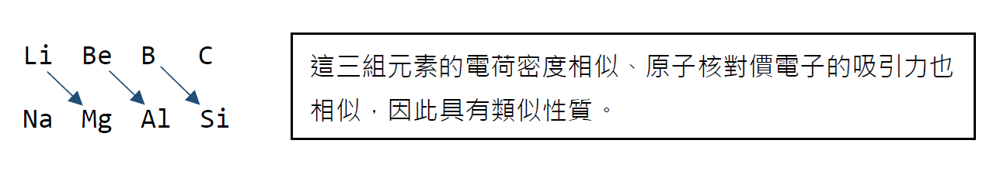
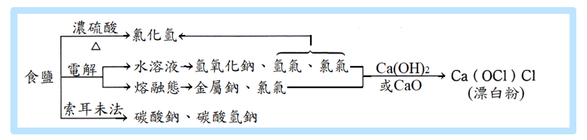

#  金屬元素與化合物

## 鹼金屬 ( IA族 )

- 價電子組態均為 ns^1^，自然界中無元素態的鹼金屬存在
- 除 Cs 為淺黃色， 其餘元素皆為銀白色
- 需保存於石油、煤油或己烷中
- 溶於水呈鹼性
- 鹼金屬為最軟的金屬群，可用普通刀片切割
- 熔點低 ( Li 最高: 186°C ； Fr 最低: 27°C)、比重小 ( Li、Na、K 皆小於 1 )
- 化合物有焰色反應：Li (鮮紅)、Na (黃)、K (紫)、Rb (紫紅)、Cs (藍)

​	*==製備==*

​	電解熔融態的鹵化物：陰極得鹼金屬，陽極得鹵素分子

>  $\ce{MX(l) -> M(s) + 1/2 X2(g)}$
>
>  當士法 (Downs process)：$\ce{NaCl(l) -> Na(s) + 1/2 Cl2(g)}$

### 鹼金屬與非金屬

#### 鹵素

- 形成離子化合物：

    > $\ce{Na + 1/2 Cl2 -> NaCl}$

#### $\ce{O2}$

- $\ce{Li2O}$
- 低溫中形成 $\ce{Na2O}$，加熱會形成 $\ce{Na2O2}$
- $\ce{K2O2}$、$\ce{KO2}$
- $\ce{RbO2}$、$\ce{CsO2}$

​	*鹼金屬氧化物溶於水均呈鹼性*

> $\ce{Na2O(s) + H2O(l) -> 2NaOH(aq)}$
>
> $\ce{Na2O2(s) + 2H2O(l) -> 2NaOH(aq) + H2O2(aq)}$

#### $\ce{H2}$

- 生成鹼金屬氫化物，放熱

    > $\ce{2Na + H2 -> 2NaH}$ ( 200°C 以上才能發生反應 )

- 鹼金屬氫化物只存在固態或熔融態，不能存在水溶液中

    > $\ce{NaH(s) + H2O(l) -> H2(g) + NaOH(aq)}$

#### $\ce{H2O}$

- 生成鹼性氫氧化物和氫氣並放出巨大能量，原子序越大反應越激烈

    > $\ce{2Na(s) + H2O(l) -> 2NaOH(aq) + H2(g)}$

#### 酸或醇

- 產生氫氣

    > $\ce{2Na + 2C2H5OH -> 2C2H5ONa + H2(g)}$
    >
    > $\ce{2Na + 2CH3COOH -> 2CH3COONa + H2(g)}$

### 鋰 ( Li )

- Li 的原子半徑很小，因此性質與 Mg 相近

    [^對角線關係 (diagonal relationship)]:半徑和性質相似。

    

- 鹼金屬化合物主要為離子鍵，但鋰化合物的鍵結有部分的共價性。

    > $\ce{LiCl}$、$\ce{LiClO4}$ 可溶於乙醇、丙酮等有機溶劑。

- 在水中最強的還原劑是 Li。( 水溶液中的還原性：Li > Rb > K > Cs > Na )

- Li 的水合能為 121 kcal/mol，大於其他離子的水合能

    [^影響水合能的因素]:水合過程必為放熱反應，離子和水靠近時會產生引力，引力越強，放出的能量越多，離子在水中越安定。因此，離子半徑越小，水合能越大。

### 鈉 ( Na )

#### NaCl ( 食鹽 )

- 製備
  1. 粗鹽

      蒸發海水製得。
  
      含有 $\ce{MgCl2}$ ( 苦味 )、$\ce{CaCl2}$ ( 易潮解 )、$\ce{MgSO4}$、$\ce{Na2SO4}$ 等雜質
  
  2. 精鹽
  
      去除雜質後的高純度 $\ce{NaCl}$。
  
      > 粗鹽溶於水，加入 $\ce{Na2CO3}$、$\ce{BaCl2}$，過濾後加熱蒸發。
      >
      > $\ce{MgCl2(aq) + Na2CO3(aq) -> MgCO3(s) v + 2NaCl(aq)}$
      >
      > $\ce{CaCl2(aq) + Na2CO3(aq) -> CaCO3(s) v + 2NaCl(aq)}$
      >
      > $\ce{MgSO4 + BaCl2(aq) -> BaSO_4(s) v + MgCl2(aq)}$
      >
      > $\ce{Na2SO4 + BaCl2(aq) -> BaSO4(s) v + 2NaCl(aq)}$ 
  
- 性質

    1. 常溫下為無色透明立方晶體、有鹹味
    2. 易溶於水，溶於水呈中性
    3. 溫度對其溶解度影響甚小

- 用途

    1. 調味、保存食物 ( 醃製 )
    2. 工業上常用以製造 $\ce{Na}$、$\ce{NaOH}$、$\ce{Na2CO3}$、$\ce{Cl2}$、$\ce{HCl}$、$\ce{HClO}$

    

#### NaOH  ( 苛性鈉、燒鹼 )

- 製備

  電解飽和濃食鹽水 ( 俗稱鹼氯工業 )。

  > $\ce{2NaCl(aq) + 2H2O ->T[ 電解 ] 2NaOH(aq) + H2(g) + Cl2(g)}$

- 性質

  1. 白色固體，極易溶於水

  2. 其水溶液有滑膩感，呈強鹼性

  3. 易吸收水分而潮解，亦可吸收 $\ce{CO2}$

     > $\ce{2NaOH + CO2 -> Na2CO3 + H2O}$

  4. 腐蝕性強，濃溶液能腐蝕玻璃，因此不能用玻璃盛裝濃 $\ce{NaOH(aq)}$

  5. 與銨鹽共熱，可產生 $\ce{NH3}$

     >  $\ce{NH4Cl + NaOH ->T[ △ ] NaCl + NH3 ^ + H2O}$
     >
     >  $\ce{(NH4)2SO4 + 2NaOH ->T[ △ ] Na2SO4 + 2NH3 ^ + 2H2O}$

- 用途

  1. 氫氧化鈉是實驗室中重要的強鹼試劑
  2. 工業上可製造肥皂、紙漿、人造絲、煉鋁工業、染料工業、食品工業等

#### Na~2~CO~3~、NaHCO~3~

- 別稱：

  1. $\ce{Na2CO3}$：蘇打、洗滌鹼、純鹼
  2. $\ce{NaHCO3}$：酸式碳酸鈉、小蘇打、焙用鹼

- 製備 ( 索耳末法 Solvay's process ) ( 亦稱氨鹼法 )

  1. $\ce{CaCO3 ->T[ △ ] CaO + CO2}$
  2. $\ce{CaO + H2O -> Ca(OH)2}$
  3. $\ce{CO2(g) + NH3(g) + H2O(l) -> NH4HCO3(aq)}$
  4. $\ce{NH4HCO3(aq) + NaCl(aq) -> NH4Cl(aq) + NaHCO3(s)}$
  5. $\ce{2NH4Cl + Ca(OH)2 -> CaCl2 + 2NH3 + 2H2O}$
  6. $\ce{2NaHCO3(s) ->T[ △ ] Na2CO3(s) + CO2(g) + H2O(l)}$

  *淨反應式 ( 原料僅為 $\ce{CaCO3}$、$\ce{NaCl}$ )*

  > $\ce{CaCO3 + 2NaCl -> Na2CO3 + CaCl2}$

- 性質

  | $\ce{Na2CO3}$              | $\ce{NaHCO3}$                            |
  | :------------------------- | :--------------------------------------- |
  | 白色粉末、易溶於水         | 白色固體，微溶於水                       |
  | 鹼性較弱、無腐蝕性         | 弱鹼 ( 溶解度、鹼性較 $\ce{Na2CO3}$ 低 ) |
  | 遇酸產生 $\ce{CO2}$        | 受熱、遇酸產生 $\ce{CO2}$                |
  | 和 Ca^2+^、Mg^2+^ 產生沉澱 |                                          |

- 用途

  1. $\ce{Na2CO3}$

     - 用於清洗 ( 例如：水壺 )
     - 軟化硬水
     - 製造玻璃、紙漿、清潔劑⋯⋯等

  2. $\ce{NaHCO3}$

     - 作為制酸劑，中和胃酸

       > $\ce{NaHCO3 + HCl -> NaCl + CO2 + H2O}$

     - 和酒石酸氫鉀混合可成為做麵包和餅乾時所用的焙粉 ( 發粉 )，受熱產生 　$\ce{CO2}$ 使麵粉膨鬆

     - 和硫酸混合可以當滅火劑

       > $\ce{2NaHCO3 + H2SO4 -> Na2SO4 + 2CO2(g) + 2H2O}$

### 鉀 ( K )

#### KNO~3~ ( 硝石 )

- 製備

  1. 自然界的礦物

  2. 人工合成法：以 $\ce{NaNO3}$ ( 智利硝石 ) 和 $\ce{KCl(aq)}$ 共熱

     > $\ce{2NaNO3(aq) + KCl(aq) -> KNO3(aq) + NaCl(aq)}$
     >
     > 先煮沸析出 $\ce{NaCl}$，再冷卻析出 $\ce{KNO3}$ 結晶。

- 性質

  1. 無色晶體，易溶於水

  2. 為良好的氧化劑，加熱至 334°C 時，會分解成 $\ce{O2}$、$\ce{N2}$ 和 $\ce{K2O}$

     > $\ce{2KNO3(s) ->T[ △ ] 2KNO2(s) + O2(g)}$
     >
     > $\ce{4KNO2(s) ->T[ △ ] 2N2(g) + 3O2(g) + 2K2O(s)}$

- 用途

  1. 製造火藥及煙火

     [^黑色火藥成分]: 75% $\ce{KNO3}$、15% 木炭、10% 硫磺粉末

  2. 作為肥料，可同時提供鉀肥、氮肥

#### K~2~CO~3~ ( 草鹼 )

- 製備

  ​	將 $\ce{CO2}$ 通入 $\ce{KOH}$

- 用途

  1. 製造玻璃、肥皂、$\ce{KOH}$ 的原料
  2. 草木灰約含 10% $\ce{K2CO3}$，因此草木灰可供洗滌之用
  3. 製造肥料，K 是植物養料三要素之一，因此古代常用草木灰當作肥料

#### KOH ( 苛性鉀 )

- 製備

  ​	電解濃 $\ce{KCl(aq)}$

- 性質

  1. 白色固體、易潮解
  2. 極易溶於水，為強鹼，有滑膩感
  3. $\ce{KOH(aq)}$ 易吸收空氣中的 $\ce{CO2}$，形成 $\ce{K2CO3}$

- 用途

  ​	和硬酯酸反應產生硬酯酸鉀，為一種軟肥皂

## 鹼土金屬 ( IIA族 )

- 價電子組態均為 ns^2^，自然界中無元素態的鹼金屬存在
- 稱為鹼土族是因為高熱不熔、不易分解，有「土」的性質
- Be 活性小，高溫亦不和水反應；Mg 會和沸水、水蒸氣反應
- Ca、Sr、Ba 需保存於石油中
- 金屬晶體結構不同，因此金屬鍵長度、熔點、沸點、密度、昇華熱、鍵能、導電性等==物理性質皆無規律性變化==
- 金屬鍵比同週期的鹼金屬強，因此熔點、硬度皆比同週期的鹼金屬大
- 隨著原子序增大，IIA族元素的還原力漸增
- 同一級游離能隨原子序增加而遞減
- 第一游離能 IE~1~：第二游離能 IE~2~ $=$ 1：2
- 氧化電位 E^0^ 隨原子序增加而遞增
- 化合物有焰色反應：Ca (磚紅)、Sr (深紅)、Ba (黃綠)

### 鹼土金屬與非金屬

#### $\ce{H2O}$

- 氧化物溶於水呈鹼性，為放熱反應，ΔH 隨原子序增加而漸增

  > $\ce{CaO(s) + H2O -> Ca(OH)2 ~~~~ ΔH = -15.6 kcal/mol}$

- 氫化物溶於水產生氫氣

  > $\ce{CaH2(s) + 2H2O(l) -> Ca(OH)2(aq) + 2H2(g)}$

- 與水反應產生氫氣

  > $\ce{CaH2(s) + 2H2O(l) -> Ca(OH)2(aq) + 2H2(g)}$

#### $\ce{OH-}$

- 鹼性：$\ce{Ba(OH)2}$ > $\ce{Sr(OH)2}$ > $\ce{Ca(OH)2}$ > $\ce{Mg(OH)2}$ > $\ce{Be(OH)2}$

- 溶解度：$\ce{Ba(OH)2}$ > $\ce{Sr(OH)2}$ > $\ce{Ca(OH)2}$ > $\ce{Mg(OH)2}$ > $\ce{Be(OH)2}$

- Be 為兩性元素，$\ce{Be(OH)2}$ 可溶於酸和鹼

  > $\ce{Be(OH)2 + 2H2+ -> Be^2+ + 2H2O}$
  >
  > $\ce{Be(OH)2 + 2OH- -> Be(OH)4^2-}$

#### $\ce{CO3^2-}$

- 碳酸鹽受熱分解產生 $\ce{CO2}$

  > $\ce{CaCO3(s) ->T[ △ ] CaO(s) + CO2(g)}$

### 鎂 ( Mg )

#### MgO

#### MgSO~4~

### 鈣 ( Ca )

#### CaO

#### CaCO~3~

#### CaSO~4~

