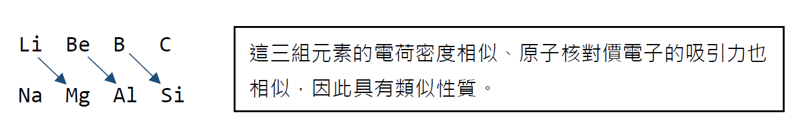
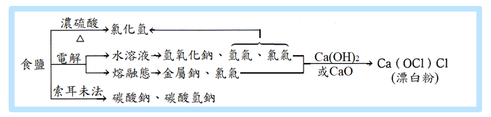
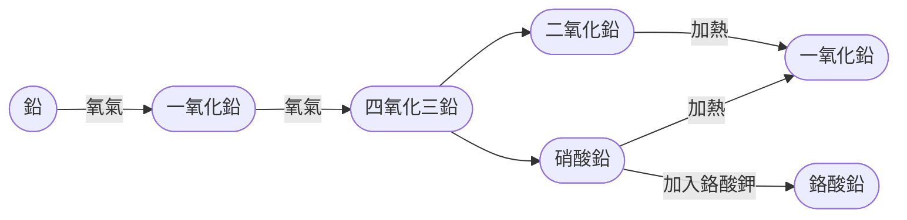

#  金屬元素與化合物

## 鹼金屬 ( IA族 )

- 價電子組態均為 ns^1^，自然界中無元素態的鹼金屬存在
- 除 Cs 為淺黃色， 其餘元素皆為銀白色
- 需保存於石油、煤油或己烷中
- 溶於水呈鹼性
- 鹼金屬為==最軟的金屬群==，可用普通刀片切割
- 熔點低 ( Li 最高: 186°C ； Fr 最低: 27°C)、比重小 ( Li、Na、K 皆小於 1 )
- 化合物有焰色反應：Li (鮮紅)、Na (黃)、K (紫)、Rb (紫紅)、Cs (藍)

​	***==製備==***

​	電解熔融態的鹵化物：陰極得鹼金屬，陽極得鹵素分子

>  $\ce{MX(l) -> M(s) + 1/2 X2(g)}$
>
>  當士法 (Downs process)：$\ce{NaCl(l) -> Na(s) + 1/2 Cl2(g)}$

### 鹼金屬與非金屬

#### 鹵素

- 形成離子化合物：

    > $\ce{Na + 1/2 Cl2 -> NaCl}$

#### O~2~

- $\ce{Li2O}$
- 低溫中形成 $\ce{Na2O}$，加熱會形成 $\ce{Na2O2}$
- $\ce{K2O2}$、$\ce{KO2}$
- $\ce{RbO2}$、$\ce{CsO2}$

​	*鹼金屬氧化物溶於水均呈鹼性*

> $\ce{Na2O(s) + H2O(l) -> 2NaOH(aq)}$
>
> $\ce{Na2O2(s) + 2H2O(l) -> 2NaOH(aq) + H2O2(aq)}$

#### H~2~

- 生成鹼金屬氫化物，放熱

    > $\ce{2Na + H2 -> 2NaH}$ ( 200°C 以上才能發生反應 )

- 鹼金屬氫化物只存在固態或熔融態，不能存在水溶液中

    > $\ce{NaH(s) + H2O(l) -> H2(g) + NaOH(aq)}$

#### H~2~O

- 生成鹼性氫氧化物和氫氣並放出巨大能量，原子序越大反應越激烈

    > $\ce{2Na(s) + H2O(l) -> 2NaOH(aq) + H2(g)}$

#### 酸或醇

- 產生氫氣

    > $\ce{2Na + 2C2H5OH -> 2C2H5ONa + H2(g)}$
    >
    > $\ce{2Na + 2CH3COOH -> 2CH3COONa + H2(g)}$

### 鋰 ( Li )

- Li 的原子半徑很小，因此性質與 Mg 相近

    [^對角線關係 (diagonal relationship)]:半徑和性質相似。

    

- 鹼金屬化合物主要為離子鍵，但鋰化合物的鍵結有部分的共價性。

    > $\ce{LiCl}$、$\ce{LiClO4}$ 可溶於乙醇、丙酮等有機溶劑。

- 在水中最強的還原劑是 Li。( 水溶液中的還原性：Li > Rb > K > Cs > Na )

- Li 的水合能為 121 kcal/mol，大於其他離子的水合能

    [^影響水合能的因素]:水合過程必為放熱反應，離子和水靠近時會產生引力，引力越強，放出的能量越多，離子在水中越安定。因此，離子半徑越小，水合能越大。

### 鈉 ( Na )

#### NaCl ( 食鹽 )

- 製備
  1. 粗鹽

      蒸發海水製得。
  
      含有 $\ce{MgCl2}$ ( 苦味 )、$\ce{CaCl2}$ ( 易潮解 )、$\ce{MgSO4}$、$\ce{Na2SO4}$ 等雜質
  
  2. 精鹽
  
      去除雜質後的高純度 $\ce{NaCl}$。
  
      > 粗鹽溶於水，加入 $\ce{Na2CO3}$、$\ce{BaCl2}$，過濾後加熱蒸發。
      >
      > $\ce{MgCl2(aq) + Na2CO3(aq) -> MgCO3(s) v + 2NaCl(aq)}$
      >
      > $\ce{CaCl2(aq) + Na2CO3(aq) -> CaCO3(s) v + 2NaCl(aq)}$
      >
      > $\ce{MgSO4 + BaCl2(aq) -> BaSO_4(s) v + MgCl2(aq)}$
      >
      > $\ce{Na2SO4 + BaCl2(aq) -> BaSO4(s) v + 2NaCl(aq)}$ 
  
- 性質

    1. 常溫下為無色透明立方晶體、有鹹味
    2. 易溶於水，溶於水呈中性
    3. 溫度對其溶解度影響甚小

- 用途

    1. 調味、保存食物 ( 醃製 )
    2. 工業上常用以製造 $\ce{Na}$、$\ce{NaOH}$、$\ce{Na2CO3}$、$\ce{Cl2}$、$\ce{HCl}$、$\ce{HClO}$

    

#### NaOH  ( 苛性鈉、燒鹼 )

- 製備

  電解飽和濃食鹽水 ( 俗稱鹼氯工業 )。

  > $\ce{2NaCl(aq) + 2H2O ->T[ 電解 ] 2NaOH(aq) + H2(g) + Cl2(g)}$

- 性質

  1. 白色固體，極易溶於水

  2. 其水溶液有滑膩感，呈強鹼性

  3. 易吸收水分而潮解，亦可吸收 $\ce{CO2}$

     > $\ce{2NaOH + CO2 -> Na2CO3 + H2O}$

  4. 腐蝕性強，濃溶液能腐蝕玻璃，因此不能用玻璃盛裝濃 $\ce{NaOH(aq)}$

  5. 與銨鹽共熱，可產生 $\ce{NH3}$

     >  $\ce{NH4Cl + NaOH ->T[ △ ] NaCl + NH3 ^ + H2O}$
     >
     >  $\ce{(NH4)2SO4 + 2NaOH ->T[ △ ] Na2SO4 + 2NH3 ^ + 2H2O}$

- 用途

  1. 氫氧化鈉是實驗室中重要的強鹼試劑
  2. 工業上可製造肥皂、紙漿、人造絲、煉鋁工業、染料工業、食品工業等

#### Na~2~CO~3~、NaHCO~3~

- 別稱：

  1. $\ce{Na2CO3}$：蘇打、洗滌鹼、純鹼
  2. $\ce{NaHCO3}$：酸式碳酸鈉、小蘇打、焙用鹼

- 製備 ( 索耳末法 Solvay's process ) ( 亦稱氨鹼法 )

  > 1. $\ce{CaCO3 ->T[ △ ] CaO + CO2}$
  > 2. $\ce{CaO + H2O -> Ca(OH)2}$
  > 3. $\ce{CO2(g) + NH3(g) + H2O(l) -> NH4HCO3(aq)}$
  > 4. $\ce{NH4HCO3(aq) + NaCl(aq) -> NH4Cl(aq) + NaHCO3(s)}$
  > 5. $\ce{2NH4Cl + Ca(OH)2 -> CaCl2 + 2NH3 + 2H2O}$
  > 6. $\ce{2NaHCO3(s) ->T[ △ ] Na2CO3(s) + CO2(g) + H2O(l)}$

  *淨反應式 ( 原料僅為 $\ce{CaCO3}$、$\ce{NaCl}$ )*

  > $\ce{CaCO3 + 2NaCl -> Na2CO3 + CaCl2}$

- 性質

  | $\ce{Na2CO3}$              | $\ce{NaHCO3}$                            |
  | :------------------------- | :--------------------------------------- |
  | 白色粉末、易溶於水         | 白色固體，微溶於水                       |
  | 鹼性較弱、無腐蝕性         | 弱鹼 ( 溶解度、鹼性較 $\ce{Na2CO3}$ 低 ) |
  | 遇酸產生 $\ce{CO2}$        | 受熱、遇酸產生 $\ce{CO2}$                |
  | 和 Ca^2+^、Mg^2+^ 產生沉澱 |                                          |

- 用途

  1. $\ce{Na2CO3}$

     - 用於清洗 ( 例如：水壺 )
     - 軟化硬水
     - 製造玻璃、紙漿、清潔劑⋯⋯等

  2. $\ce{NaHCO3}$

     - 作為制酸劑，中和胃酸

       > $\ce{NaHCO3 + HCl -> NaCl + CO2 + H2O}$

     - 和酒石酸氫鉀混合可成為做麵包和餅乾時所用的焙粉 ( 發粉 )，受熱產生 　$\ce{CO2}$ 使麵粉膨鬆

     - 和硫酸混合可以當滅火劑

       > $\ce{2NaHCO3 + H2SO4 -> Na2SO4 + 2CO2(g) + 2H2O}$

### 鉀 ( K )

#### KNO~3~ ( 硝石 )

- 製備

  1. 自然界的礦物

  2. 人工合成法：以 $\ce{NaNO3}$ ( 智利硝石 ) 和 $\ce{KCl(aq)}$ 共熱

     > $\ce{2NaNO3(aq) + KCl(aq) -> KNO3(aq) + NaCl(aq)}$
     >
     > 先煮沸析出 $\ce{NaCl}$，再冷卻析出 $\ce{KNO3}$ 結晶。

- 性質

  1. 無色晶體，易溶於水

  2. 為良好的氧化劑，加熱至 334°C 時，會分解成 $\ce{O2}$、$\ce{N2}$ 和 $\ce{K2O}$

     > $\ce{2KNO3(s) ->T[ △ ] 2KNO2(s) + O2(g)}$
     >
     > $\ce{4KNO2(s) ->T[ △ ] 2N2(g) + 3O2(g) + 2K2O(s)}$

- 用途

  1. 製造火藥及煙火

     [^黑色火藥成分]: 75% $\ce{KNO3}$、15% 木炭、10% 硫磺粉末

  2. 作為肥料，可同時提供鉀肥、氮肥

#### K~2~CO~3~ ( 草鹼 )

- 製備

  ​	將 $\ce{CO2}$ 通入 $\ce{KOH}$

- 用途

  1. 製造玻璃、肥皂、$\ce{KOH}$ 的原料
  2. 草木灰約含 10% $\ce{K2CO3}$，因此草木灰可供洗滌之用
  3. 製造肥料，K 是植物養料三要素之一，因此古代常用草木灰當作肥料

#### KOH ( 苛性鉀 )

- 製備

  ​	電解濃 $\ce{KCl(aq)}$

- 性質

  1. 白色固體、易潮解
  2. 極易溶於水，為強鹼，有滑膩感
  3. $\ce{KOH(aq)}$ 易吸收空氣中的 $\ce{CO2}$，形成 $\ce{K2CO3}$

- 用途

  ​	和硬酯酸反應產生硬酯酸鉀，為一種軟肥皂

## 鹼土金屬 ( IIA族 )

- 價電子組態均為 ns^2^，自然界中無元素態的鹼金屬存在
- 稱為鹼土族是因為==高熱不熔、不易分解==，有「土」的性質
- Be 活性小，高溫亦不和水反應；Mg 會和沸水、水蒸氣反應
- Ca、Sr、Ba 需保存於石油中
- 金屬晶體結構不同，因此金屬鍵長度、熔點、沸點、密度、昇華熱、鍵能、導電性等==物理性質皆無規律性變化==
- 金屬鍵比同週期的鹼金屬強，因此熔點、硬度皆比同週期的鹼金屬大
- 隨著原子序增大，IIA族元素的還原力漸增
- 同一級游離能隨原子序增加而遞減
- 第一游離能 IE~1~：第二游離能 IE~2~ $=$ 1：2
- 氧化電位 E^0^ 隨原子序增加而遞增
- 化合物有焰色反應：Ca (磚紅)、Sr (深紅)、Ba (黃綠)

### 鹼土金屬與非金屬

#### $\ce{H2O}$

- 氧化物溶於水呈鹼性，為放熱反應，ΔH 隨原子序增加而漸增

  > $\ce{CaO(s) + H2O -> Ca(OH)2 ~~~~ ΔH = -15.6 kcal/mol}$

- 氫化物溶於水產生氫氣

  > $\ce{CaH2(s) + 2H2O(l) -> Ca(OH)2(aq) + 2H2(g)}$

- 與水反應產生氫氣

  > $\ce{CaH2(s) + 2H2O(l) -> Ca(OH)2(aq) + 2H2(g)}$

#### $\ce{OH-}$

- 鹼性：$\ce{Ba(OH)2}$ > $\ce{Sr(OH)2}$ > $\ce{Ca(OH)2}$ > $\ce{Mg(OH)2}$ > $\ce{Be(OH)2}$

- 溶解度：$\ce{Ba(OH)2}$ > $\ce{Sr(OH)2}$ > $\ce{Ca(OH)2}$ > $\ce{Mg(OH)2}$ > $\ce{Be(OH)2}$

- Be 為兩性元素，$\ce{Be(OH)2}$ 可溶於酸和鹼

  > $\ce{Be(OH)2 + 2H2+ -> Be^2+ + 2H2O}$
  >
  > $\ce{Be(OH)2 + 2OH- -> Be(OH)4^2-}$

#### $\ce{CO3^2-}$

- 碳酸鹽受熱分解產生 $\ce{CO2}$

  > $\ce{CaCO3(s) ->T[ △ ] CaO(s) + CO2(g)}$

### 鎂 ( Mg )

#### MgO ( 苦土 )

- 製備

  1. Mg 在空氣中燃燒

     > $\ce{2Mg + O2 -> 2MgO}$

  2. 鍛燒菱鎂礦

     > $\ce{MgCO(s) ->T[ △ ] MgO(s) + CO2(g)}$

- 性質

  1. 白色粉末，略溶於水，成弱鹼性 ( $\ce{Mg(OH)2}$ )
  2. 熔點高 ( 2800°C )、有極強耐火性

- 用途

  1. $\ce{Mg}$、$\ce{KClO3}$ 的混合物 ( 10：17 ) 是閃光燈的原料
  2. 醫學上可當成制酸劑
  3. 可製造坩鍋、耐火磚、電爐的襯裏⋯⋯等等

#### MgSO~4~

- 製備

  1. 自然界的礦物

  2. 加硫酸於菱鎂礦中製備

     > $\ce{MgCO3 + H2SO4 -> MgSO4 + H2O + CO2}$

- 用途

  1. $\ce{MgSO4*7H2O}$ 是無色晶體，俗稱瀉鹽，醫學上作為瀉劑
  2. 工業上用於鞣皮和染色

### 鈣 ( Ca )

#### CaO ( 生石灰 )

- 製備

  ​	強熱灰石 ( $\ce{CaCO3}$ ) 製得

- 性質

  1. 白色無定形固體，熔點為 2614°C

  2. 與水發生消發作用 ( slaking )，放出大量熱能，稱為水化熱

     > $\ce{CaCO3(s) ->T[ △ ] Ca(OH)2(s) + 65.3 kJ}$

     [^氫氧化鈣]:俗稱熟石灰、消石灰，在空氣中易吸收 $\ce{CO2}$ 形成 $\ce{CaCO3}$

- 用途

  ​	製造 $\ce{Ca(OH)2}$、$\ce{CaC2}$、漂白粉、乾燥劑、耐熱材料、消毒劑

#### CaC~2~ ( 電石 )

- 製備

  > $\ce{CaO(s) + 3C(s) ->T[ 3000°C ] CaC2(s) + CO(g)}$

- 性質

  1. 加水產生電石氣

     > $\ce{CaC2 + 2H2O -> Ca(OH)2 + C2H2}$

  2. 加熱會和 $\ce{N2}$ 反應，產生氰胺基化鈣

     > $\ce{CaC2 + N2 ->T[ 1000°C ] C + CaCN2}$

#### CaCO~3~ ( 灰石 )

- 製備

  1. 灰石、大理石、鐘乳石的主要成分
  2. 珍珠、貝殼、珊瑚、蛋殼的主要成分
  3. 將鈣鹽 ( CaCl2、$\ce{Ca(NO3)2}$ ) 加入 $\ce{Na2CO3(aq)}$，產生 $\ce{CaCO3}$ 沉澱

- 性質

  1. 不溶於水

  2. 遇酸形成 $\ce{CO2}$

     > $\ce{CaCO3(s) + 2H+ -> Ca^2+(aq) + CO2(g) + H2O(l)}$

  3. 可溶於含 $\ce{CO2}$ 的水溶液，生成可溶性的 $\ce{Ca(HCO3)2}$，加熱容易分解出 $\ce{CO2}$

     > $\ce{CaCO3(s) + CO2(g) + H2O(l) -> Ca(HCO3)2(aq)}$
     >
     > $\ce{Ca(HCO3)2(aq) ->T[ △ ] CaCO3(s) + CO2(g) + H2O(l)}$

- 應用

  1. 形成鍋垢：水中常含有微量 $\ce{Ca(HCO3)2}$，煮水時形成 $\ce{CaCO3}$
  2. 形成鐘乳石和石筍：含 $\ce{CO2}$ 的水溶解 $\ce{CaCO3}$，而後受熱析出 $\ce{CaCO3}$
  3. 製作牙膏、牙粉、塗料、塑膠、紙張、油墨、化妝品等的填充劑
  4. 醫學上作為==長效性制酸劑==

#### CaSO~4~

- 存在

  ​	存在於自然界中，俗稱 (生) 石膏 $\ce{CaSO4*2H2O}$

  [^熟石膏]:$\ce{(CaSO4)2*H2O}$

- 性質

  1. 半透明纖維狀晶體

  2. 石膏加熱

     > $\ce{2[CaSO4*2H2O] ->T[ 125°C ] (CaSO4)2*H2O + 3H2O(g)}$
     >
     > $\ce{CaSO4*2H2O ->T[ 200°C ] CaSO4 + 2H2O(g)}$

- 用途

  1. 熟石膏加水會硬化、略微膨脹，可以製模、塑像、作為外科接骨的包紮材料

     > $\ce{(CaSO4)2*H2O + 3H2O(g) -> 2[CaSO4*2H2O]}$

  2. $\ce{CaSO4}$ 沒有熟石膏的硬化性，能製造粉筆、乾燥劑

  3. 加入適量石膏，可以控制水泥的凝固速度

  4. 製作豆腐時，加入少許石膏，能使膠體凝聚

## 其他

### 鋁 ( Al )

- 存在

  1. 地殼中含量最多的金屬，主要以鋁礬土 ( $\ce{Al2O3}$ )、冰晶石 ( $\ce{Na3AlF6}$ ) 存在
  2. 化性活潑，自然界無元素態存在

- 製備

  ​	電解法，先提純氧化鋁，再電解形成鋁

  1. 拜耳法 ( Bayer process )

     1. 將鋁礬土 ( 約含 20% $\ce{Fe2O3}$ ) 加入過量 $\ce{NaOH}$
     2. 過濾，得 $\ce{NaAl(OH)4(aq)}$
     3. 通入 $\ce{CO2}$ 後，產生 $\ce{Al(OH)3}$
     4. 加熱製得 $\ce{Al2O3}$

     > $\ce{Al2O3 + 2NaOH + 3H2O -> 2NaAl(OH)4}$
     >
     > $\ce{NaAl(OH)4 + CO2 -> Al(OH)3 + NaHCO3}$
     >
     > $\ce{2Al(OH)3 -> Al2O3 + 3H2O}$

  2. 霍爾法 ( Hall process )

     ​	用冰晶石當助溶劑，電解氧化鋁混合溶液

     > $\ce{2Al2O3(l) ->T[ 電解、約 900°C ][Na3AlF6] 4Al(s) + 6O2(g)}$

- 性質、用途

  1. 銀白色金屬，質輕，比重 2.7，熔點 660°C

  2. 外層電子組態為 3s^2^3p^1^，有 3 個價電子

  3. 具延展性，是熱與電的良導體

  4. 是兩性金屬，可溶於強酸、強鹼，釋出 $\ce{H2}$
  
     > $\ce{2Al + 6H+ -> 2Al^3+ +3H2}$
     >
     > $\ce{2Al + 2OH- + 6H2O -> 2Al(OH)4- + 3H2}$

  5. 化合物中以 +3 價存在，具有部分共價性

  6. $\ce{Al^3+}$ 電荷密度高、水合能大，因此 $\ce{Al}$ 在水溶液中為強還原劑，可還原其他金屬

     > $\ce{Al(s) -> Al^3+(aq) + 3e-}$          $\ce{E°= 1.66 V}$

  7. 在空氣中，表面易生成 $\ce{Al2O3}$，由於 $\ce{Al2O3}$ 薄膜十分緻密，可保護內部不再氧化，有防蝕功能

  8. 鋁熔劑：$\ce{Al}$ 和金屬氧化物混合，使其燃燒，還原氧化物、釋出大量熱能
  
     > 鋁熱反應 ( thermite reaction )
     >
     > $\ce{2Al + Fe2O3 ->T[ △ ] Al2O3 + 2Fe + 840 kJ}$

#### Al~2~O~3~ ( 礬土 )

- 製備

  1. 強熱 $\ce{Al(OH)3}$，可得無定形的白色粉末狀 $\ce{Al2O3}$
  2. 存在於剛玉及各種寶石中

  | 剛玉                 | 剛石粉                        | 紅寶石                        | 藍寶石                                     |
  | :------------------- | :---------------------------- | :---------------------------- | :----------------------------------------- |
  | 純 $\ce{Al2O3}$ 晶體 | $\ce{Al2O3}$，含 $\ce{Fe3O4}$ | $\ce{Al2O3}$，含 $\ce{Cr2O3}$ | $\ce{Al2O3}$，含 $\ce{Fe2O3}$、$\ce{TiO2}$ |
  | 無色                 | 黑色                          | 紅色                          | 藍色                                       |

- 性質

  1. 熔點高、硬度大

  2. 不溶於水，可溶於強酸、強鹼，為兩性氧化物

     > $\ce{Al2O3 + 6H+ -> 2Al^3+ +3H2O}$
     >
     > $\ce{Al2O3 + 2OH- + 3H2O -> 2Al(OH)4-}$

- 用途

  ​	製造人工寶石：

  > 將無定形 $\ce{Al2O3}$ 加熱融化，添加少許過渡金屬之氧化物後，經過養晶過程即可製成人造寶石，作為飾物、鐘錶或其他機械的軸承

#### Al(OH)~3~

- 製備

  ​	加氨水於鋁鹽 ( 含 $\ce{Al^3+}$ ) 溶液中，可得白色膠體狀 $\ce{Al(OH)3}$ 沉澱

  ​	*$\ce{Al(OH)3}$ 可溶於強鹼，因此==要用弱鹼製備==*

  > $\ce{Al^3+(aq) + 3NH3(aq) + 3H2O -> Al(OH)3(s) + 3NH4+(aq)}$

- 性質

  ​	為兩性氫氧化物，不溶於水，可溶於強酸、強鹼

  > $\ce{Al^3+(aq) <=>T[ OH- ][ H+ ] Al(OH)3(s) <=>T[ OH- ][ H+ ] Al(OH)4-(aq) ( 鋁酸根 )}$

- 用途

  1. 淨水劑：$\ce{Al(OH)3}$ 能膠結水中雜質，使之沉澱
  2. 媒染劑：$\ce{Al(OH)3}$ 能吸附色質與之化合，使其固定於棉紗的纖維上

#### KAl(SO~4~)~2~ • 12H~2~O

- 製備

  ​	將硫酸鋁和硫酸鉀溶液混合後蒸發而得

  > $\ce{Al2(SO4)3 + K2SO4 + 24H2O -> 2KAl(SO4)2*12H2O}$

- 用途

  1. 作為媒染劑、淨水劑
  2. 提供造紙、製筆、製革⋯⋯等等

### 礬

- 組成：由 3 價金屬離子的硫酸鹽與 1 價金屬離子的硫酸鹽所生成的複鹽
- 通式：$\ce{M^IM^{III}(SO4)2*12H2O}$
- 命名：命名為==某 ( $\ce{M+}$ ) 某 ( $\ce{M^3+}$ ) 礬==，可省略鋁、鉀

|          化學式          | 中文命名 |    簡稱    |  顏色  |
| :----------------------: | :------: | :--------: | :----: |
|  $\ce{KAl(SO4)2*12H2O}$  |  鉀鋁礬  | 鉀礬、明礬 |  無色  |
| $\ce{NH4Al(SO4)2*12H2O}$ |  銨鋁礬  |    銨礬    |  無色  |
|  $\ce{KFe(SO4)2*12H2O}$  |  鉀鐵礬  |    鐵礬    | 淡紫色 |
|  $\ce{KCr(SO4)2*12H2O}$  |  鉀鉻礬  |    鉻礬    | 黑紫色 |
|  $\ce{KMn(SO4)2*12H2O}$  |  鉀錳礬  |    錳礬    | 淡紅色 |

- 礬組成相似，均具有八面體晶形，此類物質稱為同形體
- 複鹽由兩種單鹽以簡單比例共同結晶析出，不含錯離子，溶於水會解離出單鹽離子

### 錫 ( Si )

- 存在、製備

  1. 錫石 ( $\ce{SiO2}$ ) 是自然界礦物

  2. 將錫石搗碎，經漂浮選礦、鍛燒除硫後，以煤焦還原

     > $\ce{SnO2(s) + 2C(s) -> Sn(s) + 2CO(g)}$

- 性質

  1. 熔點不高 ( 231.9°C )，易於陶鑄，是史前已知的金屬

  2. 價電子組態為 5s^2^5p^2^，氧化態有 +2、+4 價，+4 價較穩定且具有部分共價性、+2 價可作為還原劑

  3. 為兩性金屬，可溶於強酸、強鹼

  4. 銀白色，無毒，性質穩定

     > 有機錫具有強烈毒性
     >
     > [^ 三丁基錫]:Tertial Butyl Tin ( TBT )，可由飲水、飲食、呼吸進入人體，會影響人體免疫系統，甚至影響胎兒

- 用途

  1. 錫箔可作為電學器械、包裝材料，現在已被鋁箔取代
  2. 鍍錫鐵板 ( 馬口鐵 ) 光亮美觀、防鏽，用來製造罐頭容器
  3. 製作合金
     1. 焊條：50% Pb、50% Si
     2. 保險絲：伍德易合金，含 Cd、Bi、Si、Pb

#### SnCl~2~

- 製備

  ​	$\ce{Sn}$ 加入鹽酸溶液，蒸乾後得到 $\ce{SnCl2*2H2O}$

  > $\ce{Sn + 2HCl -> SnCl2(aq) + H2}$

- 性質

  ​	溶於水產生鹼式氯化亞錫 ( 白色沉澱 )，加入些許鹽酸可防止沉澱

  > $\ce{SnCl2(aq) + H2O -> Sn(OH)Cl v + HCl}$

- 用途

  ​	$\ce{SnCl2}$ 極易氧化成 $\ce{SnCl4}$，可作為還原劑

  >1. $\ce{SnCl2 + 2HgCl2 -> SnCl4 + Hg2Cl2}$
  >
  >2. $\ce{SnCl2 + 2FeCl3 -> SnCl4 + 2FeCl2}$
  >
  >3. 能使過錳酸鉀、二鉻酸鉀溶液褪色
  >
  >   $\ce{2MnO4- + 5Sn^2+ + 16H+ -> 2Mn^2+ + 5Sn^4+ + 8H2O}$

#### SnCl~4~

- 製備

  > $\ce{SnCl2(aq) + Cl2 (過量) -> SnCl4(aq)}$

- 性質

  1. 無色發煙液體
  2. 熔點 -33°C、沸點 114°C

- 用途

  ​	將 $\ce{SnCl4}$ 蒸氣、氨、水混合，會產生 $\ce{Si(OH)4}$、$\ce{NH4Cl}$ 濃煙，用以製造煙霧彈

  > $\ce{SnCl4(g) + 4NH3(g) + 4H2O(l) -> Si(OH)4(s) + 4NH4Cl(s)}$

### 鉛 ( Pb )

- 製備

  1. 在自然界中以方鉛礦 ( $\ce{PbS}$ ) 存在

  2. 燃燒方鉛礦形成 $\ce{PbO}$，在加入煤焦共熱，使之還原

     > $\ce{2PbS + 3O2 -> 2PbO + 2SO2}$
     >
     > $\ce{PbO + C -> Pb + CO}$
     >
     > $\ce{PbO + CO -> Pb + CO2}$

- 性質
  1. 銀白色重金屬、質軟
  1. 價電子組態為 6s^2^6p^2^，氧化態有 +2、+4 價，+2 價較穩定、+4 價可作為氧化劑
  1. 為兩性金屬，可溶於強酸 ( $\ce{HCl}$、$\ce{H2SO4}$ 除外，因為表面會形成難溶性 $\ce{PbCl2}$、$\ce{PbSO4}$ )、強鹼
  1. 熔點不高 ( 327.4°C )，易於陶鑄，是史前已知的金屬
  1. 毒性極強，$\ce{Pb^2+}$ 會與酵素形成錯合物，使酵素失去活性
  1. 在空氣中，表面生成鹼式碳酸鉛 ( $\ce{Pb(OH)2*PbCO3}$ ) 薄膜，使內部不再氧化
  
- 用途

  1. 作為鉛蓄電池的電極板
  2. 製作鉛磚或鉛衣，因為 Pb 可以阻擋 X 射線及其他放射線
  3. 製作焊條：50% Pb、50% Si
  4. 製造四乙基鉛 ( $\ce{Pb(C2H5)4}$ )，加入汽油可以緩和引擎震擊

#### PbO ( 密陀僧 )

- 製備

  ​	由鉛或硝酸鉛在空氣中加熱

  > $\ce{2Pb + O2 ->T[ △ ] 2PbO}$
  >
  > $\ce{2Pb(NO3)2 ->T[ △ ] 2PbO + 4NO2 + O2}$

- 性質、用途

  1. 淡黃色結晶粉末
  2. 兩性氧化物
  3. 可製造玻璃、琺瑯、釉藥 

#### Pb~3~O~4~ ( 鉛丹 )

- 製備

  > $\ce{6PbO + O2 ->T[ 500°C ] 2Pb3O4}$

- 性質、用途

  1. 鮮紅色粉末
  2. 可作為顏料
  3. 與油類相混合，塗於鐵器，可防止生鏽 ( 俗稱紅丹漆 )

#### PbO~2~

- 製備

  > $\ce{Pb3O4 + 4HNO3 -> PbO2(s) + 2Pb(NO3)2 + 2H2O}$

- 性質、用途

  1. 棕色粉末

  2. 加熱容易產生 $\ce{O2}$，可作為氧化劑

     > $\ce{2PbO2 ->T[ △ ] 2PbO + O2}$

  3. 製作鉛蓄電池的電極板

#### PbCrO~4~ ( 鉻黃 )

- 製備

  > $\ce{K2CrO4 + Pb(NO3)2 -> PbCrO4 + 2KNO3}$

- 性質、用途

  1. 不溶性黃色粉末
  2. 可作為顏料

## 過渡金屬

- 過渡元素根據其原子軌域分為：外過渡元素、內過渡元素

  1. 外過渡元素 ( d-過渡元素 )
     1. 外層 ns、(n-1)d 軌域可參與化學反應
  2. 內過渡元素 ( f-過渡元素 )
     1. 為鑭系、錒系元素 ( 不包含鑭 La、錒 Ac )
     2. 外層 ns、(n-1)d、(n-2)f 軌域可參與化學反應

- 性質

  1. 過渡元素都是金屬，具金屬光澤，是電與熱的良導體

  2. 化性差異大，並無規則

  3. 大部分具有多種氧化態

     ​	*例外：IIIB族 (+3)、Zn (+2)、Cd (+2)、Ag (+1)*

  4. 和主族元素相比，大多數過渡金屬具有高熔點、高沸點、高汽化熱、高昇華熱。但IIB族元素 ( Zn、Cd、Hg ) 例外，因為其 3d 軌域填滿，金屬鍵較弱

  5. 過渡金屬的化合物大多有顏色

     ​	*若元素的 d 軌域全滿或全無電子，則無 d–d 電子轉移，因此不顯色*

     > 水溶液中，下列離子均無色：
     >
     > $\ce{Cu+(3d^10)}$、$\ce{Ag+(4d^10)}$、$\ce{Zn^2+(3d^10)}$、$\ce{Cd^2+(4d^10)}$、$\ce{Hg^2+(5d^10)}$、$\ce{Sc^3+(3d^0)}$

### 第一列過渡金屬

### 鈦

### 鉻

### 錳

### 鐵

### 銅

### 銀

### 金

### 鋅

# 金屬錯合物

# 附錄

## 合金

## 離子顏色表

| $\ce{Cr}$      |      |                       |      |                            |        |
| :------------- | :--- | :-------------------- | ---- | -------------------------- | ------ |
| $\ce{Cr^3+}$   | 綠色 | $\ce{Cr2O7^2-}$       | 橙色 | $\ce{[Cr(NH3)5Cl]^2+}$     | 綠色   |
| $\ce{Cr2O3}$   | 綠色 | $\ce{Cr(NH3)6^3-}$    | 黃色 | 順式 $\ce{[Cr(NH3)4Cl2]+}$ | 藍紫色 |
| $\ce{CrO4^2-}$ | 黃色 | $\ce{Cr(OH)4(H2O)2-}$ | 綠色 | 反式 $\ce{[Cr(NH3)4Cl2]+}$ | 綠色   |

| $\ce{Mn}$    |          |             |          |                |      |
| :----------- | -------- | :---------- | -------- | :------------- | ---- |
| $\ce{Mn^2+}$ | 淡粉紅色 | $\ce{MnS}$  | 淡粉紅色 | $\ce{MnO4-}$   | 紫色 |
| $\ce{Mn^3+}$ | 桃紅色   | $\ce{MnO2}$ | 黑褐色   | $\ce{MnO4^2-}$ | 綠色 |

| $\ce{Fe}$    |      |                |        |                   |      |                      |        |
| ------------ | ---- | -------------- | ------ | ----------------- | ---- | -------------------- | ------ |
| $\ce{Fe^2+}$ | 綠色 | $\ce{Fe(OH)2}$ | 白色   | $\ce{Fe(CN)6^3-}$ | 紅色 | $\ce{FeSCN^2+}$      | 血紅色 |
| $\ce{Fe^3+}$ | 黃色 | $\ce{Fe(OH)3}$ | 紅褐色 | $\ce{Fe(CN)6^4-}$ | 黃色 | $\ce{Fe4[Fe(CN)6]3}$ | 深藍色 |

| $\ce{Co}$    |        |                 |      |
| ------------ | ------ | --------------- | ---- |
| $\ce{Co^2+}$ | 淡紅色 | $\ce{CoCl4^2-}$ | 藍色 |

| $\ce{Cu}$    |      |             |      |                    |        |                     |        |
| ------------ | ---- | ----------- | ---- | ------------------ | ------ | ------------------- | ------ |
| $\ce{Cu^2+}$ | 藍色 | $\ce{CuS}$  | 黑色 | $\ce{Cu(OH)2}$     | 藍綠色 | $\ce{Cu2[Fe(CN)6]}$ | 紅棕色 |
| $\ce{CuO}$   | 黑色 | $\ce{Cu2O}$ | 紅色 | $\ce{Cu(NH3)4^2+}$ | 深藍色 |                     |        |

| $\ce{Zn}$    |      |                    |      |                      |      |
| ------------ | ---- | ------------------ | ---- | -------------------- | ---- |
| $\ce{Zn^2+}$ | 無色 | $\ce{Zn(OH)4^2-}$  | 無色 | $\ce{Zn3[Fe(CN)6]2}$ | 白色 |
| $\ce{ZnS}$   | 白色 | $\ce{Zn(NH3)4^4+}$ | 無色 |                      |      |

| $\ce{Ag}$  |      |             |        |                  |        |
| ---------- | ---- | ----------- | ------ | ---------------- | ------ |
| $\ce{Ag+}$ | 無色 | $\ce{AgCl}$ | 白色   | $\ce{Ag(NH3)2+}$ | 無色   |
| $\ce{AgI}$ | 黃色 | $\ce{AgBr}$ | 淡黃色 | $\ce{Ag2CrO4}$   | 磚紅色 |

## 沉澱表

