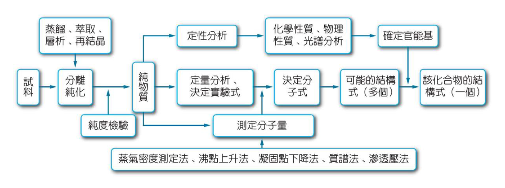

# 有機化合物簡述

## 定義 & 來源

- 定義

  1. 早期認為有機化合物來自動、植物，無機化合物來自土壤、礦物

  2. 1828 年，<u>烏拉</u> ( <u>德</u> ) 將氰酸胺分解成尿素，打破上述觀念

     > $\ce{NH4CNO ->T[ △ ] (NH2)2CO}$

  3. 近代定義：含碳的化合物、碳氫化合物及其衍生物

     > 例外 ( 無機化合物 )：
     >
     > 1. 碳的氧化物：$\ce{CO}$、$\ce{CO2}$
     > 2. 碳酸鹽：$\ce{CO3^2-}$、$\ce{HCO3-}$
     > 3. 金屬碳化物：$\ce{CaC2}$
     > 4. 氰化物：$\ce{CN-}$、$\ce{SCN-}$、$\ce{OCN-}$
     > 5. 其他：$\ce{CS2}$

- 來源

  1. 動、植物
  2. 化石燃料

### 化石燃料

#### 煤

- 形成

  ​	數百萬年前，植物經地底高溫、高壓緩慢分解，所形成的黑色物質

- 成分

  ​	主要含 C 及少量 O、H、N、S 等等

  1. 無煙煤：含 90%～95% 的煤
  2.   煙煤  ：含 75%～90% 的煤
  3.   褐煤  ：含 60%～75% 的煤
  4.   泥煤  ：含 50%～60% 的煤

- 煤的乾餾：隔絕空氣，加熱使之分解

#### 石油

- 形成

  ​	石油是百萬年前的動植物遺骸，經地底高溫高壓緩慢分解而形成

- 成分

  ​	剛開採出的原油為黑色黏稠液體，主要是烷類混合物和一些芳香烴

- 分餾

  ​	依物質的沸點不同，分段蒸餾，分離出不同有機物

  |   成分 |  組成的碳數  | 分餾溫度 ( °C ) | 用途                     |
  | -----: | :----------: | :-------------: | ------------------------ |
  | 石油氣 |  C~1~～C~4~  |      ＜20       | 燃油                     |
  | 石油醚 |  C~5~～C~6~  |     20～60      | 有機溶劑                 |
  |   汽油 | C~6~～C~12~  |     60～170     | 汽車燃料、有機溶劑       |
  |   煤油 | C~10~～C~13~ |    170～250     | 燈油、噴射機燃料         |
  |   柴油 | C~13~～C~25~ |    250～350     | 柴油機燃料、重型汽車燃料 |
  |   蠟油 | C~25~～C~30~ |    350～500     | 潤滑油、蠟燭             |
  |   重油 |   ＞C~30~    |      ＞500      | 輪船、發電廠燃料         |
  |   瀝青 |   ＞C~40~    |      ＞500      | 鋪路                     |

- 煉油

  ​	運用加熱、催化劑作用，將低經濟效益的原油裂解、轉化、重組，產出高經濟效益的油料、物料，屬於化學變化。

#### 天然氣

- 存在、成分

  ​	低分子烷類，主要為 $\ce{CH4}$、$\ce{C2H6}$，存在砂石或岩層下方

- 用途

  ​	汙染極小的優良燃料 ( 氣體 )，可製造 $\ce{NH3}$、$\ce{CH3OH}$、$\ce{(NH2)2CO}$ ( 尿素 )

  > $\ce{CH4 -> C + 2H2}$
  >
  > $\ce{N2 + 3H2 -> 2NH3}$
  >
  > $\ce{CO2 + 2NH3 -> NH2COONH4}$
  >
  > $\ce{NH2COONH4 -> NH2CONH2 + H2O}$
  >
  > $\ce{CH4 + H2O -> 3H2 + CO}$
  >
  > $\ce{CH4 + H2O -> CH3OH + H2O}$

## 組成 & 結構

### 判定有機化合物的結構

### 實驗式 ( 簡式 ) 求法

### 分子式求法

### 結構式求法

# 烴類與異構物

# 有機鹵化物

# 醇類、酚類、醚類

# 醛、酮

# 羧酸、酯類

# 胺、醯胺

