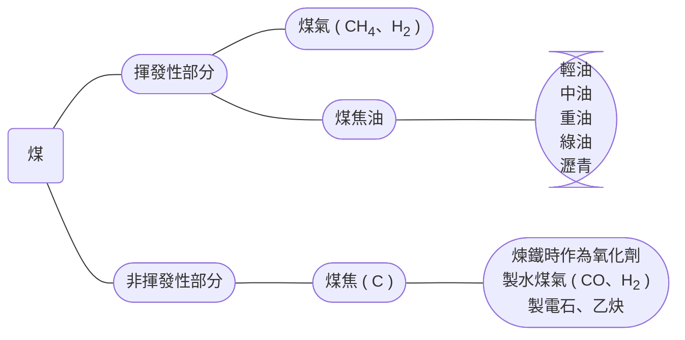

# 有機化合物簡述

## 定義 & 來源

- 定義

  1. 早期認為有機化合物來自動、植物，無機化合物來自土壤、礦物

  2. 1828 年，<u>烏拉</u> ( <u>德</u> ) 將氰酸胺分解成尿素，打破上述觀念

     > $\ce{NH4CNO ->T[ △ ] (NH2)2CO}$

  3. 近代定義：含碳的化合物、碳氫化合物及其衍生物

     > 例外 ( 無機化合物 )：
     >
     > 1. 碳的氧化物：$\ce{CO}$、$\ce{CO2}$
     > 2. 碳酸鹽：$\ce{CO3^2-}$、$\ce{HCO3-}$
     > 3. 金屬碳化物：$\ce{CaC2}$
     > 4. 氰化物：$\ce{CN-}$、$\ce{SCN-}$、$\ce{OCN-}$
     > 5. 其他：$\ce{CS2}$

- 來源

  1. 動、植物
  2. 化石燃料

### 化石燃料

#### 煤

- 形成

  ​	數百萬年前，植物經地底高溫、高壓緩慢分解，所形成的黑色物質

- 成分

  ​	主要含 C 及少量 O、H、N、S 等等

  1. 無煙煤：含 90%～95% 的煤
  2.   煙煤  ：含 75%～90% 的煤
  3.   褐煤  ：含 60%～75% 的煤
  4.   泥煤  ：含 50%～60% 的煤

- 煤的乾餾：隔絕空氣，加熱使之分解

#### 石油

#### 天然氣

## 組成 & 結構

# 烴類與異構物

# 有機鹵化物

# 醇類、酚類、醚類

# 醛、酮

# 羧酸、酯類

# 胺、醯胺

